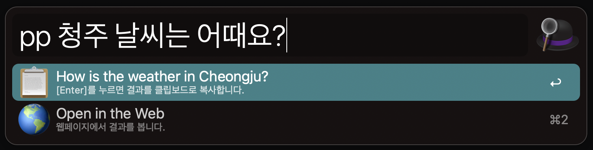
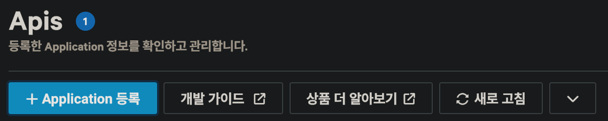
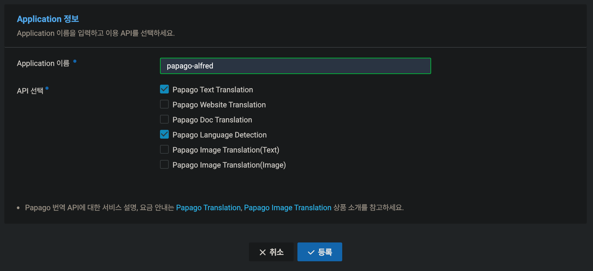
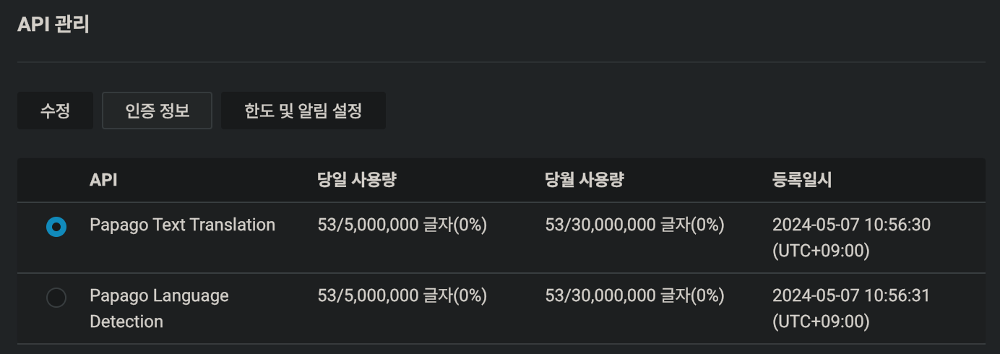
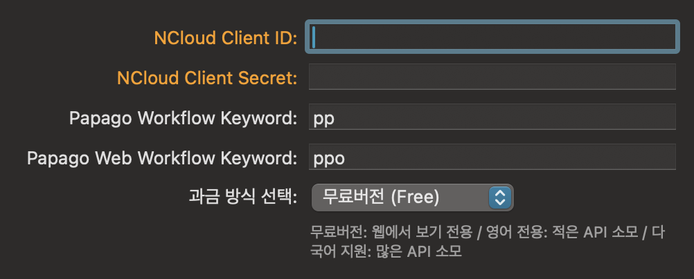

# Papago Workflow for Alfred 5

<div align="center">


**쉽고 빠른 한/영, 영/한 번역이 필요해 직접 만들었습니다! <br>**

**최신 Alfred 5를 지원합니다.<br><br>**

---

🚀   빠르고 쉽게 번역을 하고 (<kbd>pp</kbd>) 결과를 복사합니다.<br>

🛸   긴 문장 번역이 필요할 때, 웹사이트에서 결과를 볼 수도 있습니다. <br>

🌎   드디어, 다양한 언어 번역을 지원합니다!<br>


<table style="width:90; text-align:center;">
    <tr>
        <td>
        
  </td>
        <td>


</br>


        </td>
    </tr>
</table>

**[[DOWNLOAD]](https://github.com/eungbean/Alfred-Papago-Workflow/releases)**

> [!IMPORTANT]
> __오른쪽 위의 `Star⭐` 를 눌러주시면 큰 힘이 됩니다!__

</div>

## ⚡ Quickstart

### 1. 즉시 번역 및 복사하기 <kbd>pp</kbd>
<p align="center"></p>

```
pp {문장}
```

- 문장을 즉시 한/영, 영/한 번역합니다.
- 엔터키를 누르면 클립보드로 복사합니다.


### 2. 웹사이트로 이동해 번역하기

<p align="center"></p>

- 긴 문장등의 번역이 필요할 때, 브라우저에서 번역 결과를 보여줍니다.

### 3. 지원 언어 목록

- `한국어 ↔️ 영어, 일본어, 중국어 (간체, 번체), 베트남어, 인도네시아어, 태국어, 독일어, 스페인어, 이탈리아어, 프랑스어`
- 다른 언어간 번역은 추후 지원예정입니다.

## 🚀 Setup

### 0. 필수설치

(macOS Monterey 12.3 이하) Xcode의 설치가 필요합니다. [[#5](https://github.com/eungbean/Alfred-Papago-Workflow/issues/5)]
앱스토어에서 [XCode](https://developer.apple.com/download/all/?q=Xcode)를 설치해주세요.

### 1. Papago API Key 발급받기
1. NCloud 계정을 생성하고 [로그인](https://auth.ncloud.com/login) 해주세요.
2. [Console > Papago Translation API Key page](https://console.ncloud.com/papago-translation/apis)에서 `+ Application 등록`을 클릭해주세요.



3. 아래 화면에서 `Application 이름`을 입력하고 `API 선택`에서 `Papago Text Translation`, `Papago Language Detection`을 체크해주세요.



4. 성공적으로 등록이 되면 아래와 같이 표시됩니다. `API 관리` 화면에서 `인증정보` 버튼을 클릭해주세요.



5. `인증정보` 창에서 `Client ID`,`Client Secret`을 복사합니다.

6. [Alfred Workflow 설정](https://www.alfredapp.com/help/workflows/user-configuration/)에 추가해줍니다.



7. [pp 문장] 으로 번역을 테스트해보세요.


## 🧚‍♀️ Features
- [x] 한/영, 영/한 번역 기능
- [x] 바로 복사하기 및 웹사이트에서 열기
- [x] 다양한 언어쌍 번역 기능
- [ ] 타겟 언어 설정 기능
- [ ] __더 많은 기능 제안을 기다립니다!__


## ❤ Contribution is always welcome!
질문이나 버그를 발견했나요? 특정 기능이 필요하신가요?
자유롭게 새로운 이슈나 각각의 제목과 설명과 함께 PR을 제출하세요.
문제에 대한 해결책을 이미 찾았다면 망설이지 말고 공유하세요.
새로운 제안은 언제든지 환영입니다!

- (2024-05-07) https://github.com/eungbean/Alfred-Papago-Workflow/issues/7 [@dead-1ine](https://github.com/dead-1ine) [@joel-you](https://github.com/joel-you) [@taese0_0ng](https://github.com/taese0ng) Thank you for your update request for papago api shutdown issue.
*

- (2023-11) https://github.com/eungbean/Alfred-Papago-Workflow/issues/5 [@f022yo9](https://github.com/f022yo9) [@DreamingMaru](https://github.com/DreamingMaru): Thank you for discovering and resolving SSL Credential Error.

## 🎛 Workflow


## Licenses

이 프로젝트는 MIT 라이센스를 준수합니다.

```
MIT License
Copyright (c) 2021 eungbean
Permission is hereby granted, free of charge, to any person obtaining a copy
of this software and associated documentation files (the "Software"), to deal
in the Software without restriction, including without limitation the rights
to use, copy, modify, merge, publish, distribute, sublicense, and/or sell
copies of the Software, and to permit persons to whom the Software is
furnished to do so, subject to the following conditions:
The above copyright notice and this permission notice shall be included in all
copies or substantial portions of the Software.
THE SOFTWARE IS PROVIDED "AS IS", WITHOUT WARRANTY OF ANY KIND, EXPRESS OR
IMPLIED, INCLUDING BUT NOT LIMITED TO THE WARRANTIES OF MERCHANTABILITY,
FITNESS FOR A PARTICULAR PURPOSE AND NONINFRINGEMENT. IN NO EVENT SHALL THE
AUTHORS OR COPYRIGHT HOLDERS BE LIABLE FOR ANY CLAIM, DAMAGES OR OTHER
LIABILITY, WHETHER IN AN ACTION OF CONTRACT, TORT OR OTHERWISE, ARISING FROM,
OUT OF OR IN CONNECTION WITH THE SOFTWARE OR THE USE OR OTHER DEALINGS IN THE
SOFTWARE.
```
